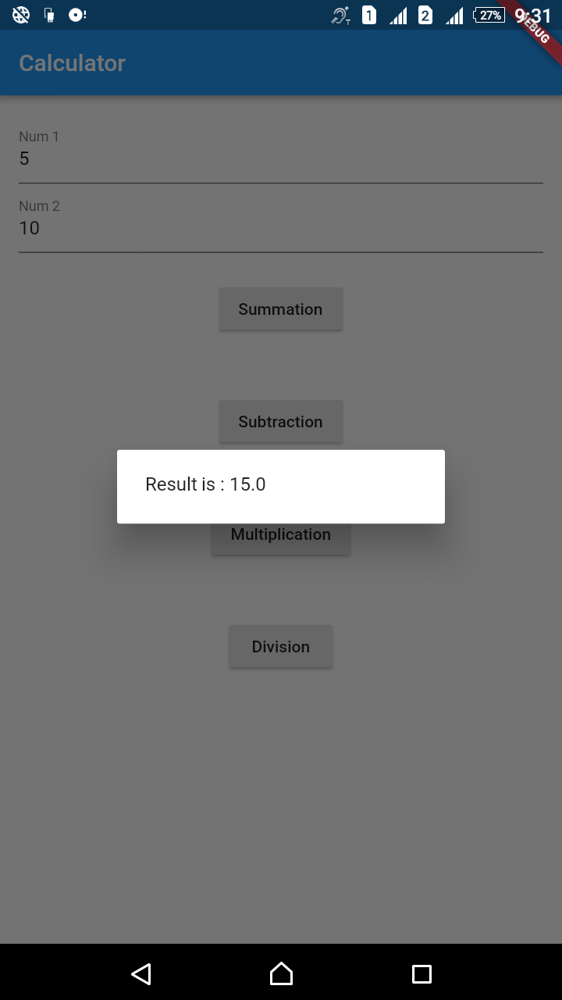
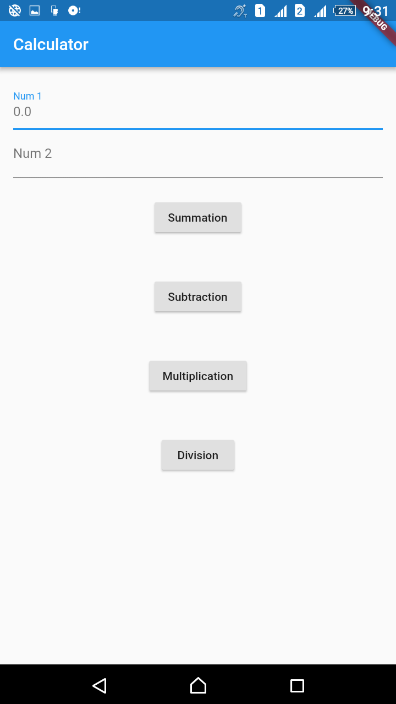

# Flutter_Calculator_MVP

Example app showing implementation of a simple calculator Using flutter with MVP architecture.

## Getting Started

For help getting started with Flutter, view online [documentation](http://flutter.io/).
